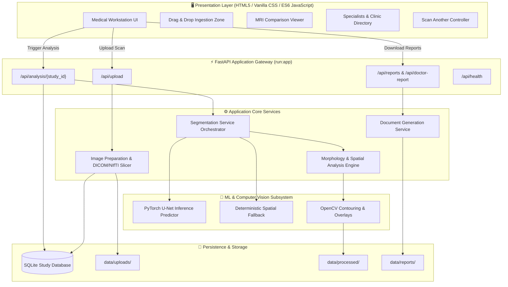
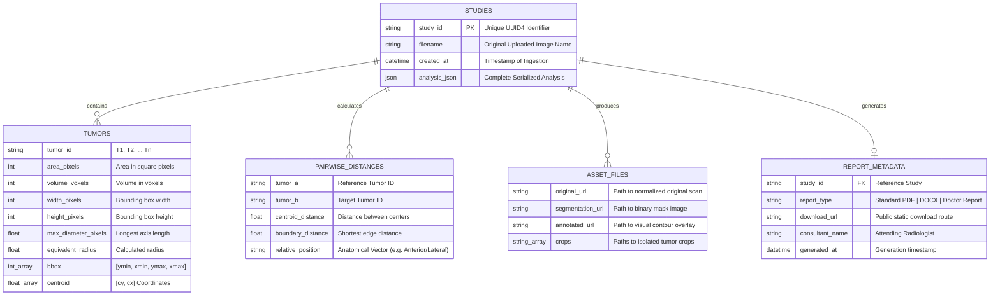

# 🧠 NeuroVision AI — Advanced Brain Tumor MRI Segmentation & Diagnostic Platform

<div align="center">


**An end-to-end clinical neuroimaging workstation and automated diagnostic report generation engine powered by deep neural U-Net spatial segmentation, morphological measurement pipelines, and certified medical document generators.**

[Key Features](#-key-features) • [Architecture](#-architecture--system-design) • [ER Diagram](#-entity-relationship-er-diagram--data-flow) • [Tech Stack](#-technologies--packages-used) • [Current Status](#-functional-status) • [Installation](#-getting-started--setup) • [API Reference](#-api-endpoints-reference)

---

</div>

## 📌 Project Overview

**NeuroVision AI** is a specialized neuro-oncology platform engineered for high-throughput brain MRI ingestion, automated hyperintense lesion boundary delineation, volumetric lesion morphometry, pair-wise spatial distance computation, and clinical document authoring. 

The system features two independent report generation workflows:
1. **Clinical Doctor's Report (PDF)**: Formatted strictly according to institutional radiology standards (neutral, non-AI radiological phrasing, patient care guidelines, diet precautions, and digital consultant signature).
2. **AI Summary Diagnostic Report (PDF & DOCX)**: Detailed quantitative metric summaries including bounding boxes, centroids, cross-sectional areas, and pairwise tumor-to-tumor proximity.

---

## ✨ Key Features

| Feature | Description |
| :--- | :--- |
| **🖼️ Multi-Modal Ingestion** | Supports high-resolution standard radiological image files (`PNG`, `JPG`, `JPEG`) as well as 3D Neuroimaging Informatics Technology Initiative volumes (`.nii`, `.nii.gz`). |
| **🔬 Neural Spatial Segmentation** | Deep learning 2D U-Net engine for pixel-level tumor contouring with automated fallback to mock mathematical segmentation when weights are unconfigured. |
| **📐 Quantitative Morphometrics** | Automated computation of cross-sectional area ($\text{px}^2$), bounding boxes, equivalent circular radii, and spatial centroids for each detected lesion focus. |
| **📏 Pairwise Distance Analysis** | Calculates centroid-to-centroid and shortest Euclidean boundary-to-boundary distances with anatomical relative positioning vectors. |
| **🩺 Clinical Doctor's Report** | Professional institutional PDF output containing patient metadata, input scan, segmented scan, radiology narrative, comprehensive lifestyle/diet recommendations, and consultant signature. |
| **🏥 Specialized Provider Directory** | Dynamic, interactive directory of neuro-oncology consultants (direct profile links) and major brain centers (Google Maps integration). |
| **📱 Cross-Platform Responsive UI** | Custom adaptive medical workstation interface optimized for 4K desktop displays, laptops, tablets, and smartphones. |
| **🔄 Instant Rescan Workflow** | One-click "Scan Another" state reset without requiring page reload, allowing continuous patient throughput. |

---

## 🏛️ Architecture & System Design

The application follows a clean modular architectural pattern decoupling backend API services, mathematical computer vision routines, machine learning inference, and document generation.



---

## 📊 Entity-Relationship (ER) Diagram & Data Flow

The database and data model utilize SQLite persistence paired with validated Pydantic models for structured analysis outputs and file asset tracking.

### Entity Relationship Model



### Component & Entity Workflow

1. **Ingestion Phase (`UploadResponse`)**: An MRI image is uploaded via `/api/upload`. A unique `study_id` UUID is generated, the file is validated, saved into `data/uploads/`, and an entry is inserted into the `studies` table.
2. **Analysis Phase (`AnalysisResult`)**: The image is preprocessed (intensity normalization, slice extraction for NIfTI) into `data/processed/`. The `SegmentationService` generates a binary mask, isolates individual connected components into `TumorResult` objects, extracts pairwise spatial relations into `PairwiseResult`, and updates `studies.analysis_json`.
3. **Reporting Phase (`ReportResponse`)**:
   - **Doctor's Report**: `doctor_report_generator.py` compiles the original scan, annotated segmented overlay, radiological observations, formatted patient lifestyle cards, and digital signature into a unified medical PDF using ReportLab `KeepTogether` flowables.
   - **Technical Report**: `pdf_generator.py` and `docx_generator.py` render tabular side-by-side lesion crops and metric tables.

---

## 🛠️ Technologies & Packages Used

### Core Frameworks & Runtime
- **[Python 3.11 / 3.12](https://www.python.org/)** — High-performance primary backend runtime.
- **[FastAPI](https://fastapi.tiangolo.com/)** (`>=0.115,<1.0`) — Modern, asynchronous web framework for building RESTful medical APIs with auto-generated OpenAPI documentation.
- **[Uvicorn (Standard)](https://www.uvicorn.org/)** (`>=0.30,<1.0`) — Lightning-fast ASGI web server implementation.
- **[Pydantic Settings](https://docs.pydantic.dev/)** (`>=2.4`) — Robust environment configuration management and strict data schema enforcement.

### Machine Learning & Computer Vision
- **[PyTorch](https://pytorch.org/)** (`>=2.0`) — Tensor computation and deep convolutional neural network execution for U-Net models.
- **[OpenCV (Headless)](https://opencv.org/)** (`>=4.10`) — Image contouring, mask dilation, morphological gradient calculation, and overlay blending.
- **[Pillow (PIL)](https://python-pillow.org/)** (`>=10.4`) — Standard raster image manipulation, format conversion, and crop rendering.
- **[NiBabel](https://nipy.org/nibabel/)** (`>=5.2`) — Medical neuroimaging I/O access for 3D NIfTI (`.nii`, `.nii.gz`) data.
- **[Scikit-Image](https://scikit-image.org/)** (`>=0.24`) — Connected component labeling, region properties extraction, and morphological perimeter calculation.
- **[SciPy](https://scipy.org/)** (`>=1.13`) — Scientific spatial distance matrices and Euclidean distance transforms.

### Document Generation
- **[ReportLab](https://www.reportlab.com/)** (`>=4.2`) — Low-level PDF generation engine with custom flowables, dynamic tables, and typography controls.
- **[python-docx](https://python-docx.readthedocs.io/)** (`>=1.1`) — Native Microsoft Word (`.docx`) document synthesis.

### Frontend Technologies
- **HTML5 & Vanilla ES6+ JavaScript** — Lightweight, high-speed asynchronous UI with zero heavy frontend bundle dependencies.
- **Vanilla CSS3 Custom Design System** — Medical dark/light balanced theme with CSS Grid, Flexbox, glassmorphic cards, micro-animations, and full responsiveness.
- **Typography** — Google Fonts (*Plus Jakarta Sans* for UI, *JetBrains Mono* for coordinates and measurements).

### Testing & Quality Assurance
- **[PyTest](https://docs.pytest.org/)** (`>=8.3`) — Automated unit, integration, and report rendering test suite.
- **[HTTPX](https://www.python-httpx.org/)** (`>=0.27`) — Asynchronous test client for endpoint validation.

---

## ⚡ Functional Status

### ✅ What is Currently Working

- [x] **File Ingestion & Validation**: Multi-format image and NIfTI file upload with automatic folder resolution and UUID generation.
- [x] **Segmentation Engine**: U-Net inference pipeline with automated fallback to mock spatial algorithm when checkpoints are unconfigured.
- [x] **Morphometric Extraction**: Real-time cross-sectional area, diameter, centroid, and bounding box computation for all detected tumors.
- [x] **Pairwise Spatial Computation**: Multi-lesion distance matrices and relative vector positioning.
- [x] **Clinical Doctor's Report PDF**: Fully formatted medical document with original scan, annotated scan, clinical narrative, patient precautions/diet guidelines, and consultant signature (with strict page-break prevention).
- [x] **Technical PDF & DOCX Reports**: Side-by-side tabular crop rendering with zero page-break gap defects.
- [x] **Provider Directory**: Searchable list of top neurosurgeons and brain tumor centers with external profile links and Google Maps integration.
- [x] **Responsive Medical Workstation UI**: Seamless usability on desktop 4K monitors, laptops, tablets, and smartphones.
- [x] **Interactive UI Controls**: Drag-and-drop ingestion, live status indicators, smooth scroll transitions, and one-click "Scan Another" reset.
- [x] **Deployment Configured**: Ready for direct deployment on Render, Railway, or Linux VPS (Ubuntu/Nginx/Gunicorn).

### 🚧 Future Roadmap & Planned Extensions

- [ ] **3D Interactive Volume Viewer**: WebGL/Three.js-based 3D brain slice visualizer for axial, sagittal, and coronal planes.
- [ ] **Multi-Sequence Fusion**: Multi-channel inputs combining T1, T1-Contrast, T2, and FLAIR modalities for enhanced differential diagnosis.
- [ ] **Hospital PACS/DICOM Networking**: Integration with Orthanc/DCM4CHEE servers via DICOMweb (WADO-RS / STOW-RS).
- [ ] **User Role Management**: Role-Based Access Control (RBAC) for Radiologists, Attending Physicians, and Patients.

---

## 🚀 Getting Started & Setup

### 1. Clone the Repository

```bash
git clone https://github.com/amitpaul2004/Brain_Tumor.git
cd Brain_Tumor
```

### 2. Set Up Virtual Environment

```bash
# On Linux / macOS
python3 -m venv .venv
source .venv/bin/activate

# On Windows (PowerShell)
python -m venv .venv
.\.venv\Scripts\Activate.ps1
```

### 3. Install Dependencies

```bash
pip install --upgrade pip
pip install -r requirements.txt
```

### 4. Run Automated Test Suite

Verify that all backend endpoints, image processing pipelines, and report generators pass:

```bash
pytest -v
```

### 5. Launch the Application

```bash
python run.py
```

Visit the interactive workstation at **`http://127.0.0.1:8000`** in your browser.  
Interactive OpenAPI documentation is available at **`http://127.0.0.1:8000/docs`**.

---

## 📡 API Endpoints Reference

| HTTP Method | Route | Description | Request Payload | Response Type |
| :--- | :--- | :--- | :--- | :--- |
| `GET` | `/api/health` | System health check and active model status | None | `JSON` (`ModelInfo`) |
| `POST` | `/api/upload` | Ingest MRI scan (`PNG`, `JPG`, `NIfTI`) | `multipart/form-data` | `JSON` (`UploadResponse`) |
| `POST` | `/api/analysis/{study_id}` | Execute neural segmentation & spatial analysis | None | `JSON` (`AnalysisResult`) |
| `GET` | `/api/analysis/{study_id}` | Retrieve cached study analysis result | None | `JSON` (`AnalysisResult`) |
| `POST` | `/api/reports/{study_id}/pdf` | Generate technical summary PDF report | None | `JSON` (`ReportResponse`) |
| `POST` | `/api/reports/{study_id}/docx` | Generate technical summary Word DOCX report | None | `JSON` (`ReportResponse`) |
| `POST` | `/api/doctor-report/{study_id}` | Generate institutional Doctor's Report PDF | None | `JSON` (`ReportResponse`) |

---

## 📁 Repository Structure

```text
Brain_Tumor/
├── backend/                  # FastAPI Application Layer
│   ├── api/                  # REST API Route Handlers (upload, analysis, reports)
│   ├── models/               # SQLite database schemas and Pydantic validation models
│   ├── services/             # Core business logic (image prep, segmentation, reporting)
│   └── config.py             # Global application configuration & directory settings
├── data/                     # Application Data Storage
│   ├── uploads/              # Raw ingested scan images
│   ├── processed/            # Normalized slices, binary masks, contour overlays
│   └── reports/              # Compiled PDF and DOCX diagnostic reports
├── frontend/                 # Client Web Workstation
│   ├── assets/               # Branding assets, consultant signatures, favicons
│   ├── css/                  # Responsive medical stylesheet (style.css)
│   ├── js/                   # Asynchronous application logic (app.js)
│   └── index.html            # Main diagnostic dashboard
├── ml/                       # Deep Learning Module
│   ├── checkpoints/          # Saved model weights (.pth)
│   ├── inference/            # U-Net inference predictor
│   └── models/               # PyTorch 2D U-Net neural architectures
├── processing/               # Mathematical Computer Vision Core
│   ├── measurements.py       # Centroid, area, and bounding box geometry
│   ├── segmentation.py       # Deterministic spatial mock engine
│   └── spatial_analysis.py   # Pairwise Euclidean proximity algorithms
├── reports/                  # Document Generation Engines
│   ├── doctor_report_generator.py # Institutional Doctor's Report PDF engine
│   ├── pdf_generator.py      # Quantitative AI summary PDF builder
│   └── docx_generator.py     # Microsoft Word report builder
├── tests/                    # Automated PyTest Test Suite
├── requirements.txt          # Production Python package manifest
├── run.py                    # Production entrypoint script
└── README.md                 # Project Documentation
```

---

## ⚠️ Clinical & Legal Disclaimer

> [!IMPORTANT]
> **RESEARCH AND DECISION-SUPPORT PROTOTYPE ONLY**  
> This software is intended solely for biomedical research, computer vision benchmarking, and educational evaluation. It is **not** certified as a medical device (CE-IVD / FDA 510(k)) and must **not** be used as a primary diagnostic tool, surgical planning system, or treatment prescription instrument. All automated segmentation boundaries and measurements must be verified by a board-certified radiologist or qualified neuro-oncology specialist.

---

<div align="center">

Developed with ❤️ for Advanced Neuroimaging Research

</div>
